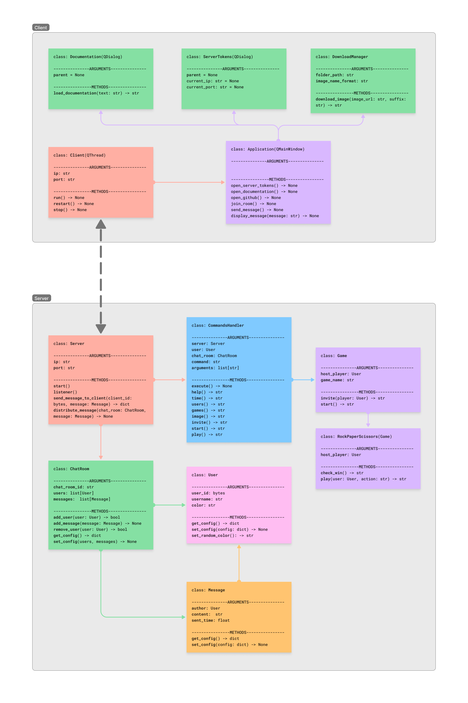

# Chat-app

## Aperçu

Chat-app est une application Python qui permet d'envoyer et de recevoir des messages. Le client peut envoyer des messages dans des salons de chat dans lesquels il peut entrer des commandes qui permettent de lister les utilisateurs, de générer une image avec DALL-E, de joue à des jeux simples...

## Consignes

-   Sujet libre
-   A réaliser en binome
-   Date de rendu : 5 mars 2024
-   Support de rendu :
    -   Présentation écrite (format numérique) contenant une présentation du travail, des recherches, de la répartition des
        tâches, des idées d'amélioration du projet, des connaissance acquises pendant les recherches...
    -   Facultatif : présentation orale sous forme d'une vidéo (2 min maximum) qui présente le projet
-   Le code doit pouvoir tourner sur les ordi du lycée (éviter d'installer trop de packages)

## Cahier des charges

-   Démarche projet (25 points)
    -   Respect du programme de NSI (POO, récusivité, TAD...)
    -   Idée globale : originalité et créativité
    -   Organisation du travail : composition de l'équipe, rôles et répartition des taches
-   Fonctionnement et opérationnalité (50 points)
    -   Qualité et structure du code
    -   Test et validation / correction des bugs
    -   Qualité de la documentation technique
-   Communication et qualité du dossier (25 points)
    -   Présentation écrite
    -   Présentation orale (facultatif)
    -   Démonstration du projet
    -   Respect des consignes

## Code

### Arborescence

```bash
.
├── classes.png
├── client                           # Fichiers relatifs au client
│   ├── application.py               # Gère l'interface graphique
│   ├── client.py                    # Gère la transmission des données entre le serveur et le client
│   ├── design                       # Fichiers d'interfaces
│   │   ├── application.ui
│   │   ├── documentation.ui
│   │   └── server.ui
│   ├── dialogs.py                   # Gère les pop-up de la toolbar de l'application
│   ├── download.py                  # Gère le téléchargement d'images
│   ├── fonts                        # Polices d'écritures
│   │   ├── SpaceMono-Bold.ttf
│   │   └── SpaceMono-Regular.ttf
│   ├── images                       # Images téléchargées par 'downloads.py'
│   │   ├── 2024-03-03_10-20-03.png
│   │   └── 2024-03-03_10-34-27.png
│   ├── main.py                      # Code exécutable pour démarrer l'application
│   └── resources                    # Ressources graphiques de l'application
│       └── icon.ico
├── executable                       # Dossier de sortie du package auto-py-to-exe
│   └── main 
│       ├── _internal                # Fichiers externes de l'exécutable 
│       └── main.exe                 # Application client exécutable
├── README.md                        # Documentation
├── requirements.txt                 # Librairies nécessaires pour exécuter le code
├── server                           # Fichiers relatifs au serveur
│   ├── api                          # Fichiers relatifs aux APIs
│   │   ├── api.py                   # Contient les fonctions créees à partir des APIs
│   │   └── credentials.json         # Contient les tokens d'API
│   ├── chatroom.py                  # Gère les salons de chat
│   ├── commands.py                  # Gère les commandes exécutables par l'utilisateur
│   ├── data                         # Données du serveur
│   │   └── server.log               # Historique des actions du serveur
│   ├── games.py                     # Gère les jeux auquel l'utilisateur peut jouer
│   ├── log.py                       # Gère la manière dont les logs sont gérés
│   ├── main.py                      # Code exécutable pour démarrer le serveur
│   ├── message.py                   # Gère les messages
│   ├── server.py                    # Code principal du serveur
│   └── user.py                      # Gère les utilisateurs
└── tests                            # Contient les unitées de test
    ├── test_chatroom.py
    ├── test_games.py
    ├── test_message.py
    └── test_user.py
```

### Classes

Voici la représentation des liens entre les différentes classes du projet.



## Installation Windows

Ce projet gère des relations client/serveur avec le module `zmq`, il est donc impératif de vérifier qu'il n'y ait pas d'antivirus bloquant les connexions sortantes/entrantes de l'application. L'antivirus par défaut de Windows ne bloquera normalement pas le programme.

Pour simplement utiliser l'application client, vous pouvez ouvrir l'exécutable [main.exe](output/main/main.exe) généré avec le package `auto-py-to-exe`. Par défaut, Windows le considèrera comme un fichier malveillant ce qui n'est pas le cas. Vous pouvez aussi générer par vous-même l'exécutable en utilisant `auto-py-to-exe` et en y incluant les dossiers `design`, `fonts`, `images` et `ressources`.

Pour interpréter le code, suivez les étapes suivantes. Vous pouvez vous aider de la vidéo « [Configuration de l'environnement virtuel](https://youtu.be/Fv3_tDsTktM?si=W1k5NubJR_rJmr8o) ».

Selon les versions de Windows, la commande pour utiliser Python peut varier entre `py`, `python` ou `python3` donc faites en fonction de ce qui marche avec votre machine. Nous utiliserons `python` dans les instructions suivantes.

Vérifiez que vous avez la dernière version de Python (que vous pouvez télécharger [ici](https://www.python.org/downloads/)) et que pip est à jour (en exécutant `python -m pip install --upgrade pip`).

Pour contenir les packages, il est préférable de mettre en place un environnement virtuel avec Python. Cela permettra d'installer les packages nécessaires uniquement pour ce projet. Pour cela, ouvrez un terminal (en administrateur) dans le dossier source du repository et exécutez les commandes suivantes :

### Création de l'environnement virtuel

```bash
python -m venv .venv
```

### Activation de l'environnement virtuel

```bash
.venv\Scripts\activate.bat
```

### Installation des packages

On peut désormais installer les librairies requises avec la commande suivante :

```bash
pip install -r requirements.txt
```

Une fois l'installation terminée, on peut maintenant exécuter l'application client ou lancer le serveur.

### Exécuter l'application client

```bash
cd client # Naviguer dans le dossier 'client'
python main.py
```

### Lancer le serveur

```bash
cd server # Naviguer dans le dossier 'server'
python main.py
```

Attention, vous obtiendrez surement une erreur car le fichier `credentials.json` qui contient les tokens d'API n'est pas inclus dans le repository. Vous devez générer vous-même vos tokens avec l'API. Vous pourrez ainsi les intégrer dans le fichier credentials.json de la façon suivante :

```json
{
    "open-ai" {
        "api-key": "API_KEY",
        "user-id": "USER_ID",
    }
}

```

## Utilisation (client)

### Connexion au server

Une fois l'application client ouverte, vous pouvez modifier les informations du serveur. Par défaut, le client essaye de se connecter à `127.0.0.1` sur le port `5555`. Si vous faites tourner le serveur sur votre machine, vous pouvez le laisser tel quel.

Pour pouvoir utiliser l'application en ligne, connecter-vous à l'IP `149.202.45.5` et au port `5555`. Cela peut arriver que ça ne marche pas du premier coup donc il ne faut pas hésiter à réessayer.

### Rejoindre un salon

Une fois que vous avez validé la nouvelle adresse du serveur, vous pouvez entre un nom d'utilisateur (ex: `User01`) et un nom de salon (ex: `general`). Vous pouvez appuyer sur `Join` et si tout se passe bien, vous devriez voir apparaitre `system: The user User01 has joined the chat!` comme sur l'image ci-dessous.


Vous avez maintenant accès au salon de chat `general` et vous pouvez exécuter des commandes. Essayer par exemple `/help` qui vous listera toutes les commandes possibles.

### Commencer un jeu

Admettons qu'il y ait deux utilisateurs `User01` et `User02` dans le salon `general`. Si `User01` veut jouer pierre feuille ciseaux avec `User02`, il peut taper la commande `/invite rps User02` pour l'inviter à jouer à `rps` (Rock Paper Scissors). Une fois qu'il l'a invité, il peut démarrer le jeu avec la commande `/start`. Les deux joueurs peuvent maintenant taper la commande `/play [action]` en remplaçant `[action]` par `rock`, `paper` ou `scissors`. Une fois que les deux ont joué, le résultat s'affiche et ils peuvent à nouveau rejouer.


